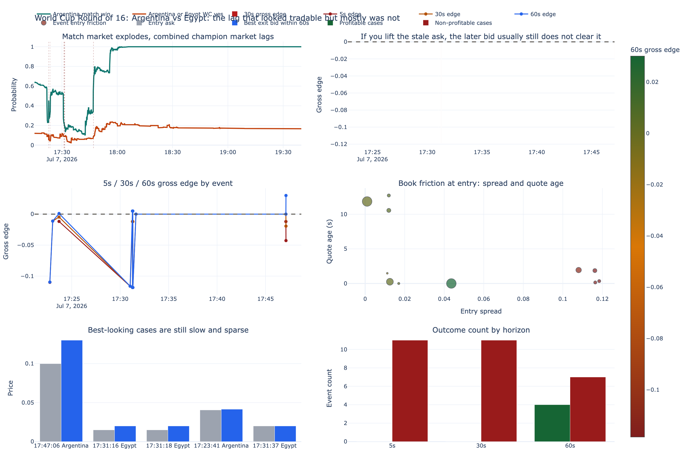
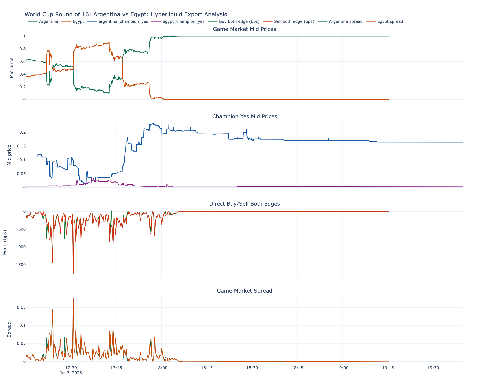
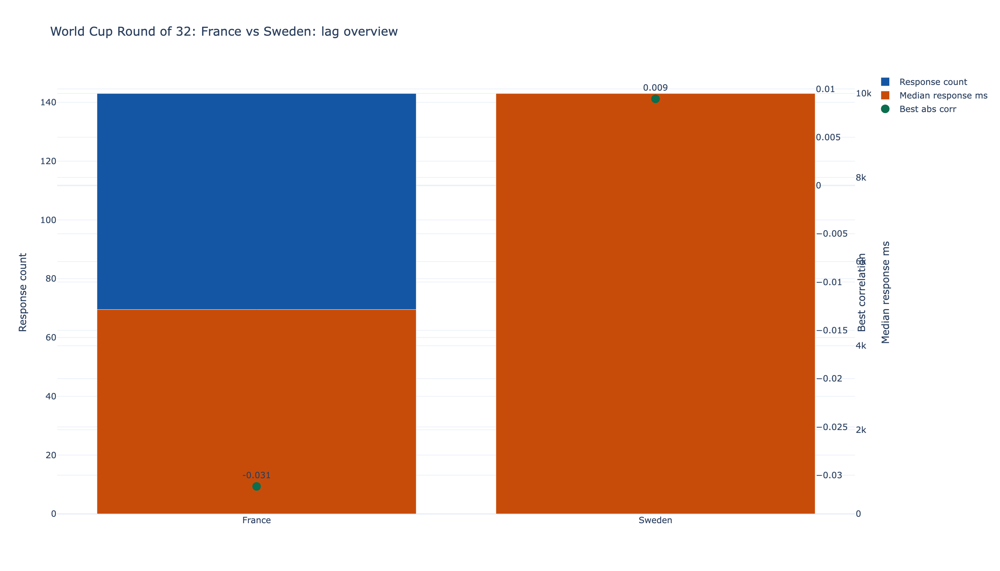
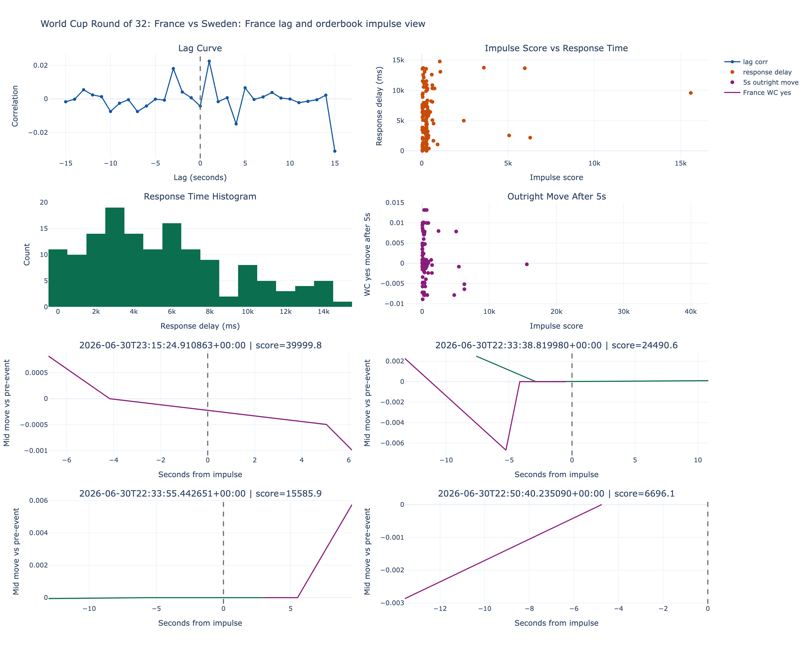
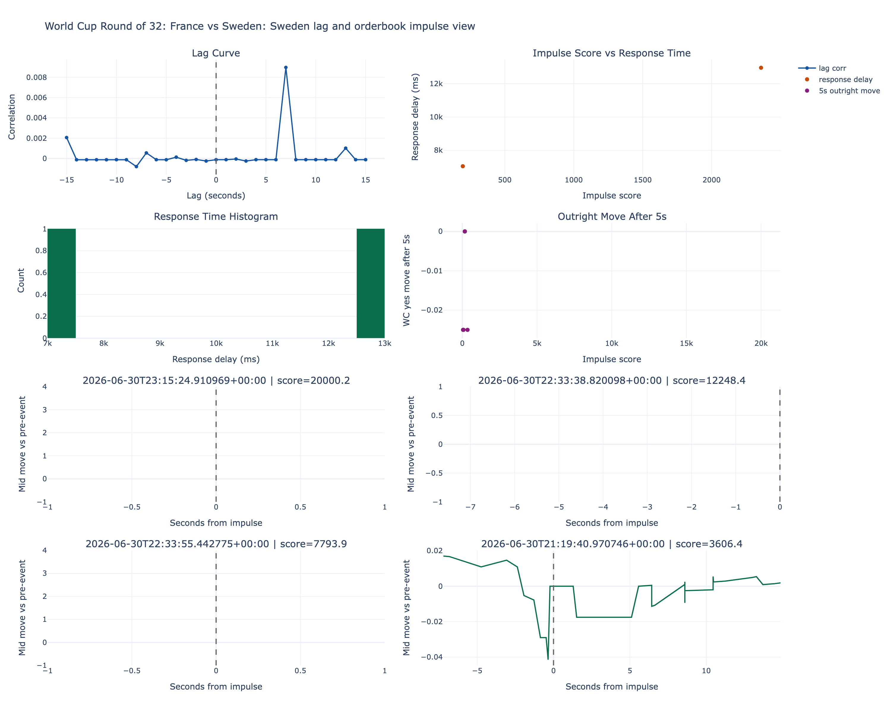
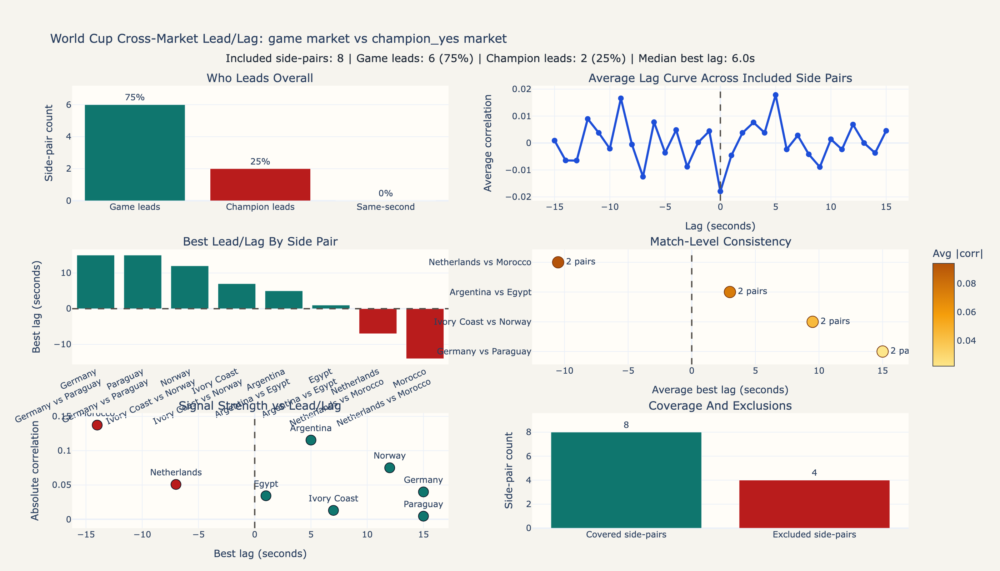

# Visuals

Static PNG exports of selected HTML research dashboards from the original local
analysis workspace.

These are included as documentation artifacts rather than complete interactive
dashboards. Each visual is linked to the dataset or dataset family it explains.

## `argentina_egypt_live`

Dataset sample:
[`data/samples/argentina_egypt_live`](../data/samples/argentina_egypt_live)

This dataset is the strongest published sample for cross-market lag detection.
The visuals below show both the apparent opportunity and the execution problem
that made the signal hard to monetize.

Source HTML:
`outputs/failed_lag_exploit_viz/argentina_egypt_failed_lag_exploit.html`

Source HTML:
`outputs/world_cup_match_analysis/argentina_egypt_live_2026-07-07_19-40-57Z/dashboard.html`

## `france_sweden_orderbook_live`

Dataset sample:
[`data/samples/france_sweden_orderbook_live`](../data/samples/france_sweden_orderbook_live)

This is the strongest published order-book sample. These visuals summarize
lag-response behavior and the asymmetric quality of France and Sweden response
signals.

Source HTML:
`outputs/france_sweden_orderbook_analysis/overview.html`

Source HTML:
`outputs/france_sweden_orderbook_analysis/france_lag_dashboard.html`

Source HTML:
`outputs/france_sweden_orderbook_analysis/sweden_lag_dashboard.html`

## Cross-Market Lead-Lag Summary

Linked datasets:

- [`argentina_egypt_live`](../data/samples/argentina_egypt_live)
- [`france_morocco_live`](../data/samples/france_morocco_live)
- `germany_paraguay_live`
- `netherlands_morocco_live`

The cross-market overview is useful as a summary figure, but only the first two
linked datasets above currently have public samples in this repository.

Source HTML:
`outputs/cross_market_lead_lag_all/lead_lag_dashboard.html`
